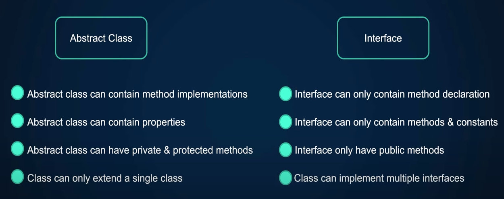
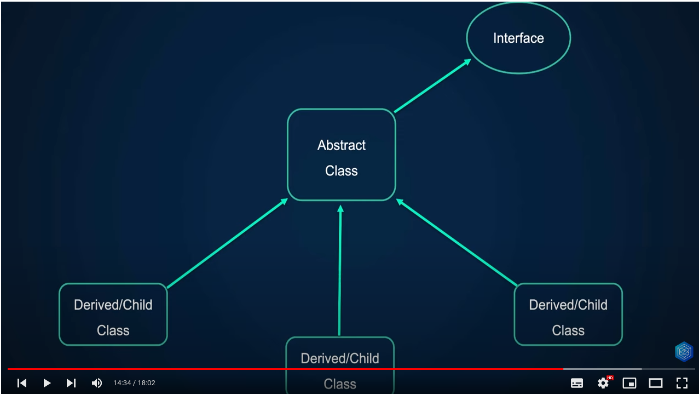

### Interface
Interfaces is like a contract that defines all the necessary actions or methods that an object must have


The way of creating an Interface is the same we use to create a class but using the Interface keyword instead

```php
<?php

namespace App;

interface DebtCollector
{
    public function collet(float $owedAmount): float;
    
}

```

ALL the methods declared within the interface MUST be implemented within the concrete classes.

```php
<?php

namespace App;

class CollectionAgency implements DebtCollector
{
    public function collect(float $owedAmount): float
    {
        // TODO: Implement collect() method
    }
}
```

Other rules of Interfaces
- All methods declared with an interface MUST be public
- As similar to inheritance, the same signature compatibility rules apply to implemented methods
- You can force concrete classes to have magic methods. You could have a __construct declaration within the interface to force the concrete class that implements it to have also a __construct method.
```php
interface DebtCollector
{
    public function __construct(); // All the concrete classes MUST have a __construct
    public function collet(float $owedAmount): float;    
}
```
- You can implement multiple interfaces:
```php
class CollectionAgency implements DebtCollector, AnotherInterface
{
    public function collect(...)
}
```

- In inheritance `extends` keyword can be used to extend from a single class. However you can use `extends` keywor within an interface to extend multiple interfaces :

```php
<?php

namespace App;

interface DebtCollector extends AnotherInterface, SomeOtherInterface
{
    public function __construct();
    public function collet(float $owedAmount): float;
}
```
Now, any concrete classes that implements this interface will have to provide method implementations for all the methods declared in this interface and all the methods declared in all the interfaces that this interface extends.

- You cannot have properties in interfaces, but you can have constants. Constants defined in an interface cannot be overriden.


Now let's implement an interface in the real example:
```php
<?php

namespace App;

interface DebtCollector
{
    public function collet(float $owedAmount): float;
}
```

```php
<?php

namespace App;

class CollectionAgency implements DebtCollector
{

    public function collet(float $owedAmount): float
    {
        $guaranteed = $owedAmount * 0.5;

        return mt_rand($guaranteed, $owedAmount);
    }

}
```

`index.php`:

```php
<?php

require_once __DIR__ . '/../vendor/autoload.php';

$collector = new \App\CollectionAgency();

echo $collector->collect(100) . PHP_EOL;
```

This works fine but what is the problem that we're trying to solve. 
What's the problem that interfaces solve because we haven't encountered any issues so far.

So we're going to introduce the problem into the code so that we can see the importance and the usefullness of interfaces and how and what problems it actually solves:
To do that we need to have a method that accepts the DebtCollector as an argument. it could be another class or a service classe of some sort.

```php
<?php

namespace App;

class DebtCollectionService
{

    // within the service class we have a method that collects debts
    // and takes DebtCollector as an argument
    // The goal of this method is to figure out how much that is owed
    // and then call the collect method on the DebtCollector instance and
    // finally maybe do some processing.
    // But for now we're just printing out how much it collects
    public function collectDebt(CollectionAgency $collector)
    {
        $owedAmount = mt_rand(100, 1000);
        $collectedAmount = $collector->collect($owedAmount);

        echo 'Collected €' . $collectedAmount . ' out of €' . $owedAmount . PHP_EOL;
    }
}
```

and in `index.php`:
```php
<?php

require_once __DIR__ . '/../vendor/autoload.php';

$service = new \App\DebtCollectionService();

echo $service->collectDebt(new \App\CollectionAgency()) . PHP_EOL;
```

Everything's working. So what is the problem we're trying to solve?

If we look closer to `DebtCollectionService` class, the problem is we're being too specific
about the implementation in the argument:
```php
    public function collectDebt(CollectionAgency $collector)
```
We're saying that this method accepts a collector argument ant the type of that collector is
`CollectionAgency`. So we're being very specific on what type of implementation of the `DebtCollector`
we are accepting.

What if down the road we want to change the debt collector. Maybe we want to hire Rocky to collect our debt. 
Or maybe move to another agency. If that happens we would need to update a lot of code and it would be a lot harder to maintain the codebase.

To demonstrate this problem, let's create another debt collector class and we'll call it Rocky
So as Rocky is another type of debt collector we can implement the `DebtCollector` interface:
```php
<?php

namespace App;

class Rocky implements DebtCollector
{
    public function collect(float $owedAmount): float
    {
        return $owedAmount * 0.65;
    }
}
```
And if in `index.php` we change the argument of collect to Rocky
```php
<?php

require_once __DIR__ . '/../vendor/autoload.php';

$service = new \App\DebtCollectionService();

echo $service->collectDebt(new \App\Rocky()) . PHP_EOL;
```
we have this error warning about the wrong type's used :
`Fatal error: Uncaught TypeError: App\DebtCollectionService::collectDebt(): Argument #1 ($collector) must be of type App\CollectionAgency`.

And that makes sense because in `DebtCollectionService` we're being very specific about the type of collector we accept:
```php
public function collectDebt(CollectionAgency $collector)
```
And then when we pass another debt collector like Rocky, it's going to fail.

So this is the problem:
- We assume the specific implementation and because of this you might have heard the phrase 
>program or code to an interface instead of implementation

Because the method `collectDebt` in the `DebtCollectionService` should not care what the implementation is, it should just care that some sort of the implementation of the commom interface is given. 

To fix this problem we need to use interfaces. And because both our debt collectors `Rocky` and `CollectionAgency` share a commom interface we could simply use this interface to type hint this argument:

```php
    public function collectDebt(DebtCollector $collector)
```
And now this class do not care about the specific implementation. It only cares that some sort of implementation of this interface is given as the argument.

This is also called **POLYMORPHISM**, the last principle of Object Oriented Programming.

Polymorphism means 'many forms'.
An object can be considered polymorphic if it can pass multiple instances of checks, which would indicate that it can take many forms.

We're accepting an implementation of `DebtCollector` as an argument here:
```php
    public function collectDebt(DebtCollector $collector)
```
Can this argument pass multiple instances of checks ?

The `instanceof` keyword can be used to check if a variable or an object is an instance of some other class:
```php
class DebtCollectionService
{
    public function collectDebt(DebtCollector $collector)
    {
        var_dump($collector instanceof Rocky); // returns true
        var_dump($collector instanceof CollectionAgency); // returns true
```
Because it passes multiple checks of `instanceof` then this argument `DebtCollector` can be considered polymorphic.

In the other hand, when we had the concrete implementation of `CollectionAgency` as an argument, this would not pass more than one `instanceof` check and therefore is not polymorphic.

So now you can see that passing `DebtCollector` as an argument for the `collectDebt` method, Rocky will work and will always collect 65% of the owedAmount:
And we can change this to another implementation like `CollectionAgency` and it will work:
`index.php`
```php
echo $service->collectDebt(new \App\Rocky()) . PHP_EOL;
```
or 

```php
echo $service->collectDebt(new \App\CollectionAgency()) . PHP_EOL;
```

Interface is like a contract.

Polymorphism can be implemented using interfaces because an object can take many forms.

Can't the same be done using abstract classes with abstract methods?
The answer is YES, because abstract classes kind of enforce a contract to the concrete classes.
And also polymorphism can be implemented using abstract classes and inheritance because an object can pass multiple `instanceof` checks, but the problem is that it makes you use inheritance which might  not be a good idea in some cases.

### Abstract Class x Interface



Can we have interfaces within abstract classes ? YES

You mightt gave an interface that defines a contract or set of methods that need to be implemented
and then you define an abstract class that implements that interface and you're still enforcing the contract to your concrete classes while providing some base functionality.


To make this clear, let's use the abstract class `Field` we created in previous lesson. 

Instead of using the abstract method `render`, we can create an interface called `Renderable` and implement it in the `Field` abstract class:

```php
<?php

namespace App;

interface Renderable
{
    public function render(): string;
}
```

```php
<?php

namespace App;

abstract class Field implements Renderable
{
    public function __construct(protected string $name)
    {

    }
}
```

This will work as worked before and it will allows us to use the `Renderable` interface in any other class that need to render something.

In order to decide when use interfaces you should answer this question:
- Can your class have multiple different implementations? If yes, then use interfaces

Also if you find yourself doing bunch of conditionals to check the type of a class using `instanceof` or using switch, that's another indicator that interfaces and polymorphism cold be used.

You could also reach for interfaces when you want to provide a contract or a template without implementation details.

